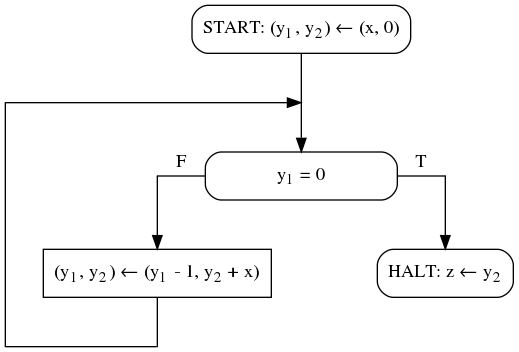

1. Запишите блок-схему с 1 входной переменной, вычисляющей ее факториал.
1. Запишите блок-схему с 2 входными переменными, вычисляющую количество простых чисел между ними.
1. На рисунке изображена блок-схема, приведены несколько спецификаций. Домены всех переменных - множество всех целых чисел. Ответьте на вопрос про каждую из спецификаций, является ли эта блок-схема частично корректной относительно неё?

    1. <code>&straightphi;(x) &equiv; x &ge; 0</code>, <code>&psi;(x, z) &equiv; z = x&sup2;</code>
    1. <code>&straightphi;(x) &equiv; T</code>, <code>&psi;(x, z) &equiv; z = x&sup2;</code>
    1. <code>&straightphi;(x) &equiv; |x| > 10</code>, <code>&psi;(x, z) &equiv; |z| > 100</code>
    1. <code>&straightphi;(x) &equiv; x > 0</code>, <code>&psi;(x, z) &equiv; z > x</code>
    1. <code>&straightphi;(x) &equiv; x &ge; 0</code>, <code>&psi;(x, z) &equiv; z &ge; x</code>
1. Для каждой приведенной ниже спецификации напишите блок-схемы с указанными ниже свойствами, если они существуют. Домен всех входных и выходных переменных - множество всех целых чисел.
    - блок-схема, не являющая частично корректной относительно данной спецификации;
    - блок-схема, являющаяся частично, но не полностью корректной относительно данной спецификации, при этом блок-схема должна завершаться на всем подмножестве входного домена, для которого существует элемент выходного домена, удовлетворяющий постусловию;
    - блок-схема, являющаяся полностью корректной относительно данной спецификации.
    1. <code>&straightphi;(x&#8321;, x&#8322;) &equiv; x&#8321; > x&#8322; &ge; 0</code>, <code>&psi;(x&#8321;, x&#8322;, z&#8321;, z&#8322;) &equiv; z&#8321; > x&#8321; > z&#8322; > x&#8322;</code>
    1. <code>&straightphi;(x&#8321;, x&#8322;) &equiv; 0 > x&#8321; > x&#8322;</code>, <code>&psi;(x&#8321;, x&#8322;, z&#8321;, z&#8322;) &equiv; x&#8321;&sup2; > z&#8321; > x&#8322;&sup2; > z&#8322;</code>
    1. <code>&straightphi;(x&#8321;, x&#8322;) &equiv; x&#8321; > x&#8322; &ge; 0</code>, <code>&psi;(x&#8321;, x&#8322;, z&#8321;, z&#8322;) &equiv; x&#8322;&sup2; > z&#8321; > x&#8321;&sup2; > z&#8322;</code>
    1. <code>&straightphi;(x&#8321;) &equiv; x&#8321; > 0</code>, <code>&psi;(x&#8321;, z&#8321;, z&#8322;) &equiv; z&#8321; = x&#8321; * z&#8322; &and; z&#8321; < z&#8322;</code>
1. Докажите или опровергните утверждения о {частичной} или &#10092;полной&#10093; корректности. Заглавными буквами обозначены блок-схемы, строчными - логические формулы.
    1. <code>&forall; a &forall; P &exist; b such as {a}P{b} &rArr; {b}P{a}</code>
    1. <code>&forall; a &forall; P &exist; b such as &#10092;a&#10093;P&#10092;b&#10093; &rArr; {b}P{a}</code>
    1. <code>&forall; P &exist; a &exist; b such as &#10092;a&#10093;P&#10092;b&#10093;</code>
    1. <code>&forall; P &exist; a &exist; b such as {a}P{b} &and; &not; &#10092;a&#10093;P&#10092;b&#10093;</code>

