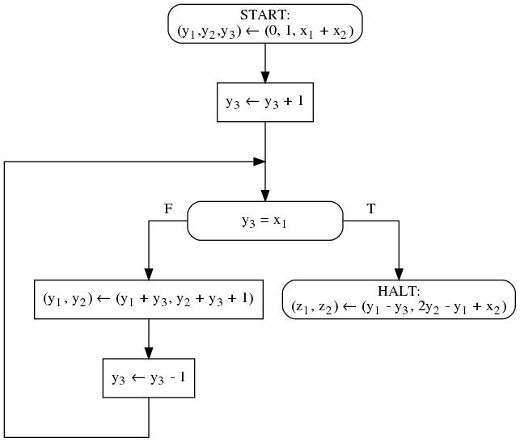
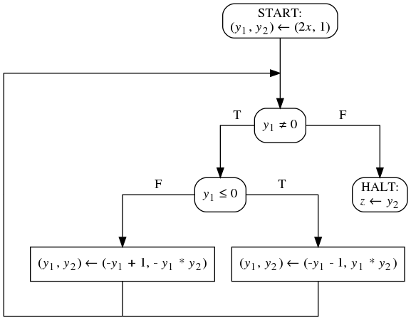

1. Пусть вам дали некоторую блок-схему и спецификацию к ней.
   Вы знаете метод индуктивных утверждений Флойда, т.е. умеете
   предлагать инварианты циклов и при помощи них доказывать
   частичную корректность. Данная вам блок-схема, как оказалось,
   не является частично корректной. Но вы уже видите
   инварианты циклов. Можно ли их использовать для
   конструктивного доказательства некорректности блок-схемы?
   То есть поиска значений входных переменных, на которых
   предусловие выполнено и блок-схема не зацикливается,
   но значения выходных переменных не удовлетворяют постусловию?
1. Вам дана блок-схема над 2 входными, 3 промежуточными и
   2 выходными переменными. Домены всех переменных - множество
   всех целых чисел. Вам дана спецификация над этими же
   переменными. При помощи метода индуктивных утверждений
   докажите, что блок-схема частично корректна относительно спецификации.
<code>&straightphi;(x&#8321;, x&#8322;) &equiv; x&#8322; &ge; 0</code>
<code>&psi;(x&#8321;, x&#8322;, z&#8321;, z&#8322;) &equiv; z&#8321; - x&#8321; = z&#8322; - x&#8322;</code>

1. Вам дана блок-схема над 1 входной, 2 промежуточными и
   1 выходной переменными. Домены всех переменных - множество
   всех целых чисел. Вам дана спецификация над этими же
   переменными. При помощи метода индуктивных утверждений
   докажите, что блок-схема частично корректна относительно спецификации.
<code>&straightphi;(x) &equiv; x &ge; 0</code>
<code>&psi;(x, z) &equiv; z = (2x)!</code>

1. Какое требуется минимальное число точек сечения,
   чтобы доказать частичную корректность хотя бы одной блок-схемы,
   имеющей указанные особенности, относительно хотя бы одной
   спецификации при помощи методов Флойда, если блок-схемы
   с указанными особенностями существуют.
   Если ответ зависит от спецификации, привести не менее
   двух разных ответов и обосновать их.
    1. блок-схема содержит 2 цикла;
    1. блок-схема содержит не менее одного оператора соединения;
    1. блок-схема зацикливается на всех значениях входных данных из своих доменов;
    1. операторы и связки блок-схемы разбиваются на 3 независимые связные части так, что первая и вторая часть обладают единственной общей связкой, вторая и третья часть обладают единственной общей связкой, а первая и третья часть не обладают общими связками. Общих операторов у частей нет.
