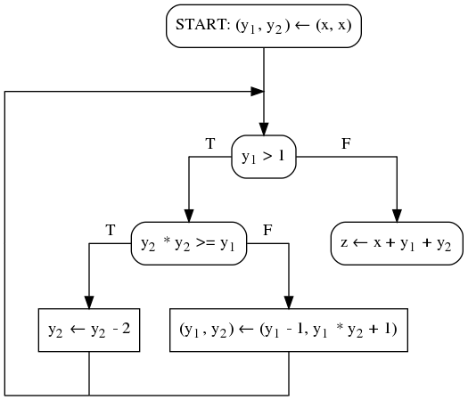
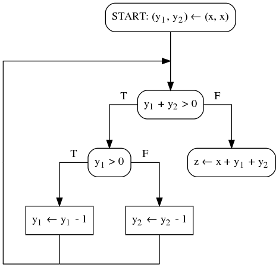
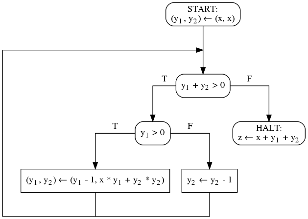
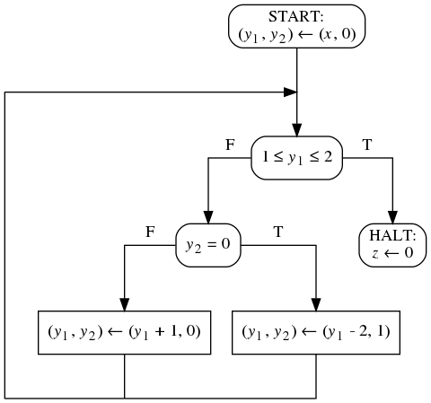

1. Вам дана блок-схема над 1 входной, 2 промежуточными
   и 1 выходной переменной. Домены всех переменных - множество
   всех целых чисел. Вам дана спецификация над этими же
   переменными. При помощи методов Флойда докажите, что
   блок-схема полностью корректна относительно спецификации.
<code>&straightphi;(x) &equiv; x > 0</code>
<code>&psi;(x, z) &equiv; z > x</code>

1. Вам дана блок-схема над 1 входной, 2 промежуточными
   переменными. Домены всех переменных - множество всех целых
   чисел. Вам дано предусловие над этими же переменными.
   При помощи методов Флойда докажите, что блок-схема
   завершается на этом предусловии.
<code>&straightphi;(x) &equiv; x &ge; 0</code>

1. Вам дана блок-схема над 1 входной, 2 промежуточными
   переменными. Домены всех переменных - множество всех
   целых чисел. Вам дано предусловие над этими же переменными.
   При помощи методов Флойда докажите, что блок-схема
   завершается на этом предусловии.
<code>&straightphi;(x) &equiv; x &ge; 0</code>

1. Вам дана блок-схема над 1 входной, 2 промежуточными
   переменными. Домены всех переменных - множество всех
   целых чисел. Вам дано предусловие над этими же переменными.
   При помощи методов Флойда докажите, что блок-схема
   завершается на этом предусловии.
<code>&straightphi;(x) &equiv; x &gt; 0</code>

1. Пусть у нас есть блок-схема и предусловие. Завершаемость
   блок-схемы на этом предусловии доказана по методу
   фундированных множеств с выбранным фундированным
   множеством `(U, a)` и выбранными оценочными функциями
   ui. Возможно ли доказать завершаемость
   тем же методом с использованием тех же точек сечения и
   _тождественных_ функций в качестве оценочных? Если да,
   то сделайте это на каком-нибудь примере и для всех случаев.
