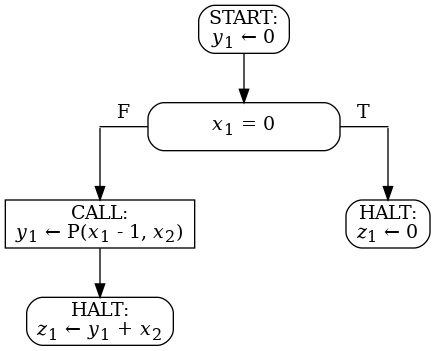
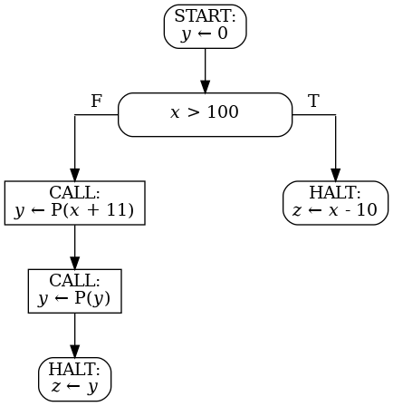

1. Вам дана блок-схема над 2 входными, 1 промежуточной
   и 1 выходной переменной. Домены всех переменных - множество
   всех целых чисел. Вам дана спецификация над этими же
   переменными. При помощи методов Флойда докажите, что
   блок-схема полностью корректна относительно спецификации.
<code>&straightphi;(x1,x2) &equiv; x1 &geq; 0</code>
<code>&psi;(x1, x2, z1) &equiv; z1 &leq; x1 * x2</code>

1. Вам дана блок-схема над 1 входной, 1 промежуточной
   и 1 выходной переменной. Домены всех переменных - множество
   всех целых чисел. Вам дана спецификация над этими же
   переменными. При помощи методов Флойда докажите, что
   блок-схема полностью корректна относительно спецификации.
<code>&straightphi;(x) &equiv; T</code>
<code>&psi;(x, z) &equiv; if x > 100 then z = x - 10 else z = 91</code>

